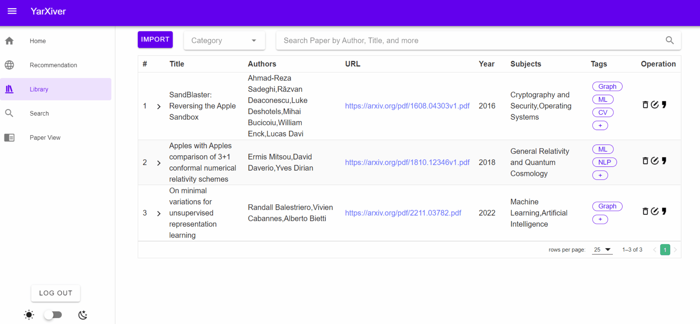

# 

📖 YarXiver is a fancy literature management system to help users collect, organize, search, recommend, cite, and view arXiv papers.  

# 🚀 How to Run It
To run YArXiver locally, you need to install a number of dependencies, but don't worry because we use **Docker** to package all the dependencies. Therefore what you need to do is to only make sure that you have installed the latest [Docker](https://docs.docker.com/engine/install/) with [Docker Compose](https://docs.docker.com/compose/) properly. Once you did, just run 
```
./build_and_run.sh
```
to run the application in a docker container, open your browser, type `localhost` or `localhost:80`, And enjoy YArXiver!

# ➡️ Features

## 👤 User Account
- Log in 
- Sign up 
- Log out


## 📝 Paper Management
- Paper Importing   
When you find a paper in [arxiv](https://arxiv.org/), you can import it via URL like: 
https://arxiv.org/pdf/2211.03781.pdf (Recommended), 
https://arxiv.org/abs/2211.03781

- Paper Clustering   
The system supports various ways to organize the collected papers imported by users.
- Paper Filtering   
Filter paper by author name, paper topic, or the tag defined by users themself
- Paper Tagging   
Tag the paper, remove and edit the tag.
- Paper Deleting   
Delete paper from the library.
- Paper Ranking   
The system supports users to rank the collected papers by publish years, authors, and title.




## 🔎 Paper Searching
- Library Searching    
The system can return a paper list of the collected paper by title keyword or author name.  
- Online Searching  
The system supports online searching using title, url, and keywords.
- Add paper/Export BibTex/View Paper in Search Result Page  
- Recent Paper History    
Show recent paper Searching history at the Home page.  


## 💻 Paper Recommendation
The system is able to recommend paper to users according to   
- user's paper search history  
- current viewing paper in paper view

You can easily add the recommended paper to you library or export its bibTex by clicking "add this paper to library" or "export bibTex".  


## 👀 Paper View
- Open and view Paper in the system. 
- Find recommended paper similar with this paper and easily add it to library and export bibTex. 


## 🌙 Reading Mode
- Dark Mode/Bright Mode   
User can switch between dark mode and bright mode.


# Stacks
- Front-end: HTML + CSS + JavaScript, Vue.js + Vuetify 3
- Backend: Python (using Flask framework)
- Database management system: MySQL 5.7.29
- Version Control: Git

# Acknowledgements
Third-party APIs used include
- vue-pdf-embed
- arxiv
- arxiv2bib  

Author： YArXiver Team
